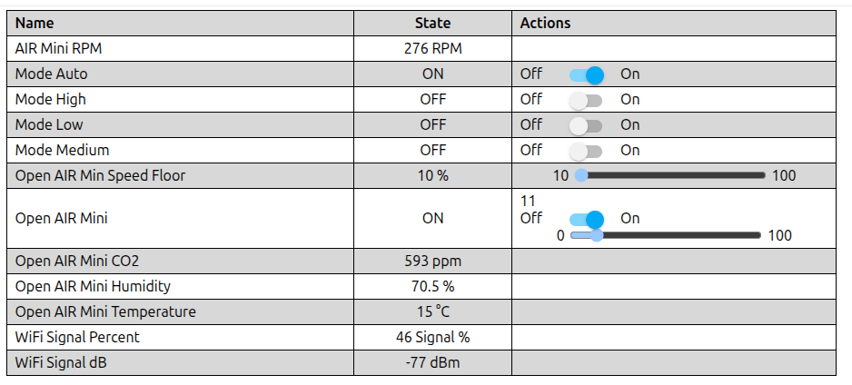
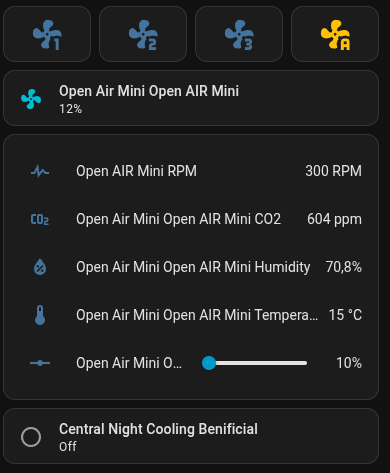
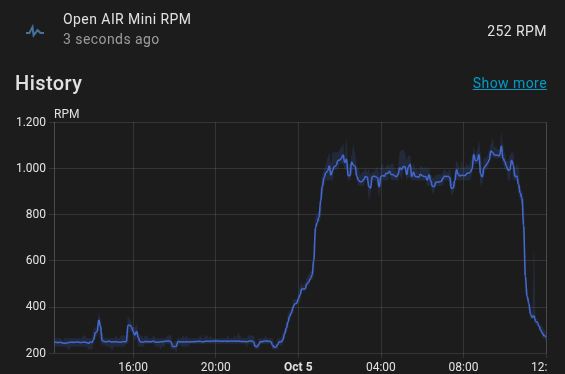

# OpenAir Mini Firmware

This is a modified version of the Open Air Mini firmware to make the unit work stand alone.

Main features:
- Low/Medium/High/Auto modes
- Auto mode based on CO₂ and Humidity
- When disconnected from Home Assistant, mode Auto is enabled
- Night cooling support
- Motor startup boost to prevent the motor from failing to start at very low speed

The firmware exposes the 4 modes as different buttons. If one mode button is pressed, all other modes are disabled. Only one mode is active at the same time. These buttons are added to make it easier to add mode buttons in Home Assistant.
The 'Open AIR Min Speed Floor' allows overriding the min speed. This can be used to implement night cooling. When Home Assistant detects that the outside temp is 4C cooler then indoor and indoor is above 20C, it sets this to 40%. 

The home assistant dashboard is almost a 1-to-1 copy of the exposed buttons/sensors.

The ventilation speed is gradually controlled based on CO₂ levels and humidity.

[The firmware in openair.yaml.](../openair.yaml)
